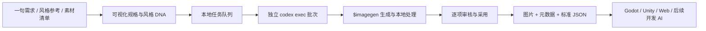

<p align="center">
  
</p>

<h1 align="center">Codex Asset Forge</h1>

<p align="center">
  用本机 Codex CLI 把一句想法、风格参考或长篇素材清单，变成可审核、可追踪、可交接的 2D 游戏素材。
</p>

<p align="center">
  <em>A local-first visual production studio for Codex-powered 2D game assets.</em>
</p>

<p align="center">
  
  
  
  
</p>

> 桌面程序目前仍显示 **UI Forge**。这是为了继续读取已有的 macOS 工作区；开源仓库名使用 **Codex Asset Forge**。

## 为什么做这个项目

在聊天框里偶尔生成一张图很简单，真正困难的是把几十乃至几百个素材稳定地做完：统一风格、明确尺寸、跟踪每一项进度、保留失败日志、审核多个交付物，并把最终路径与语义交给下一位开发 AI。

Codex Asset Forge 把这件事做成了一条本地生产线：

- 复用本机 Codex CLI 的登录状态；使用 ChatGPT 登录时，默认不需要另外配置 OpenAI API Key。
- 每个批次启动独立的临时 Codex 对话，避免一个超长上下文拖慢全部任务。
- 任务、图片、日志、参考图和标准 JSON 都保存在本机工作区。
- 用户能看到每一项进度、耗时、错误和最终采用结果，而不是面对一个不可控的黑盒任务。
- 可从 Markdown 素材清单生成数百条标准任务，并按风格和类型自动分批。

> [!IMPORTANT]
> 这不是“免费或无限生图”工具。Codex 内置图像生成仍会计入你的 Codex 使用额度，而且通常比纯文本任务消耗额度更快。它节省的是额外的 API Key 配置、单独的 API 账单和手工管理成本。详见 OpenAI 的 [图像生成说明](https://learn.chatgpt.com/docs/image-generation.md) 与 [认证说明](https://learn.chatgpt.com/docs/auth.md)。

## 界面与风格

<p align="center">
  
</p>

项目内置 12 套可直接注入任务的游戏 UI 风格，并支持通过对话、文字描述和 1～2 张参考图创作自己的风格 DNA。参考图可以按批次选择性附带，不会覆盖原始文字风格要求。

## 核心能力

| 模块 | 能做什么 |
| --- | --- |
| 创作台 | 把中文需求编译为完整生成规格；选择组件、状态、尺寸、透明背景、风格和参考图 |
| 风格工作室 | 与 Codex 对话打磨风格 DNA，生成验证样张，保存文字描述与参考图 |
| 清单任务 | 导入 MD/TXT/JSON，生成稳定 ID、文件名、尺寸、目录、提示词、状态和验收规则 |
| 批量生产 | 1/4/5/6 条同风格同类型素材共用一个 Codex 对话；逐项展示进度、耗时和结果 |
| 审核与采用 | 查看大图，在多个交付物之间选择，批量采用，并生成可供其他 AI 直接读取的元数据 |
| 智能拆图 | 自动检测或按任意行列规则无损切分素材表，导出 PNG、`assets.json` 和目录清单 |
| 资源中心 | 管理 Kenney、Game-icons、模型目录和可选 ComfyUI 后端 |
| 引擎交接 | 输出 Godot、Unity、Web 可用的运行路径、标准 JSON 与语义素材索引 |

## 工作流



清单任务的典型流程是：

1. 导入游戏原型阶段产出的素材清单。
2. Codex 分段提取任务，并补齐风格、尺寸、文件名、运行目录与验收标准。
3. 选择批次大小和并发数，再按批次或任务精确执行。
4. 生成结果默认选中第一个可用交付物；需要时再人工调整。
5. 导出标准 JSON 或语义素材索引，让后续 AI 无需重新识图即可继续开发。

## 环境要求

- Node.js 20 或更新版本
- npm
- 可用的 Codex CLI
- 已登录的 ChatGPT/Codex 账户，或自行选择 API Key 登录
- macOS Apple Silicon：可构建当前桌面 App

先确认 Codex 状态：

```bash
codex --version
codex login status
```

若尚未登录：

```bash
codex login
```

Codex CLI 支持 ChatGPT 登录和 API Key 两种认证方式；本项目默认复用已经保存的 CLI 登录。官方说明见 [Codex authentication](https://learn.chatgpt.com/docs/auth.md)。

## 快速开始

```bash
git clone https://github.com/<your-name>/codex-asset-forge.git
cd codex-asset-forge
npm ci
npm run dev
```

浏览器打开 [http://127.0.0.1:1420](http://127.0.0.1:1420)。开发模式会同时启动：

- Vite 界面：`127.0.0.1:1420`
- 本地任务服务：`127.0.0.1:4319`

服务只监听本机地址，不提供任意命令执行接口。

## 构建 macOS App

```bash
npm run app:build
```

Apple Silicon 构建产物位于：

```text
release/mac-arm64/UI Forge.app
```

App 会自动选择空闲端口、启动本地服务并连接 Codex CLI。关闭 App 后，本地服务会随之退出。正式工作区位于：

```text
~/Library/Application Support/UI Forge/workspace
```

## Codex 是怎么被调用的

生成任务使用 Codex CLI 的非交互模式：

```text
codex exec --ephemeral --json --sandbox workspace-write
```

- `--ephemeral`：每个任务或小批次使用独立临时对话，控制上下文体积。
- `--json`：接收结构化事件，用于展示进度、阶段、工具调用和错误日志。
- `--sandbox workspace-write`：仅允许任务在工作区内写入结果。
- `$imagegen`：显式要求 Codex 使用内置图像生成能力。

这是 Codex 官方支持的非交互执行方式；详细行为见 [Non-interactive mode](https://learn.chatgpt.com/docs/non-interactive-mode.md)。

## 数据都保存在哪里

开发模式默认使用仓库目录；打包 App 使用独立的用户工作区。主要目录如下：

```text
data/                         本地任务状态、风格项目和运行日志
outputs/                      生成结果
outputs/task-manifests/       素材清单存档、标准 JSON、采用结果
outputs/splits/               智能拆图结果与日志
references/                   用户上传的参考图
library/imports/              下载到本机的开源素材包
```

这些运行时目录已经加入 `.gitignore`。仓库不会读取或提交 `~/.codex/auth.json`；该文件包含 Codex 登录凭据，任何情况下都不应上传、复制到 issue 或分享给他人。

## 智能拆图的可选 Python 环境

自动检测和无损裁切需要 Pillow、NumPy 与 SciPy。推荐使用独立虚拟环境：

```bash
python3 -m venv .venv
source .venv/bin/activate
python -m pip install Pillow numpy scipy
UI_FORGE_PYTHON_BIN="$PWD/.venv/bin/python" npm run dev
```

规则网格切分不需要 AI；只有希望 Codex 自动理解、命名和分类图片内容时才需要额外的视觉处理。

## 配置

| 环境变量 | 用途 | 默认值 |
| --- | --- | --- |
| `CODEX_BIN` | 指定 Codex CLI 可执行文件 | ChatGPT App 内置 Codex 路径 |
| `UI_FORGE_API_PORT` | 本地任务服务端口 | `4319` |
| `UI_FORGE_WORKSPACE_DIR` | 数据与输出工作区 | 当前目录 |
| `UI_FORGE_STATIC_DIR` | 静态前端目录 | 开发模式由 Vite 提供 |
| `UI_FORGE_PYTHON_BIN` | 智能拆图使用的 Python | 自动探测 |
| `UI_FORGE_MANIFEST_CHUNK_TIMEOUT_MS` | 单段清单分析超时 | `300000` |
| `UI_FORGE_GENERATION_CONCURRENCY` | 同时运行的生成批次 | `1`，界面最多 `3` |

## 明确的容量与行为边界

- 单个清单项目默认最多 200 条任务，可在界面设置为 20～500。
- 单个 Codex 批次可包含 1、4、5 或 6 条同风格、同类型任务。
- 最多同时运行 3 个 Codex 批次。
- 不明原因的生成失败最多自动重试 3 次，之后交给用户处理。
- 智能拆图单次最多导入 20 张图片；规则网格最多预览 250 个区域。
- App 重启后会恢复排队中和运行中的批次，并优先保留已经写入的有效文件。

这些限制都会在界面中显示；任务提交结果也会明确报告请求数、实际入队数、批次数和跳过原因。

## 开源素材与许可证

项目可以下载或登记第三方素材，但第三方内容不随仓库一起提交：

- [Kenney UI Pack](https://kenney.nl/assets/ui-pack)：CC0
- [Game-icons.net](https://game-icons.net/)：CC BY 3.0，发布游戏时需按其要求署名

每个导入目录都会保存 `source.json`，记录来源、许可证、导入时间和必要署名。使用者仍需自行确认模型、LoRA、参考图及最终生成内容适用于自己的发行场景。

## 公开仓库安全检查

提交前运行：

```bash
npm run audit:public
```

检查会阻止常见 API Key、Token、私钥、本机用户绝对路径、运行日志、用户参考图和生成结果进入 Git。它只输出文件名与命中的规则，不会把疑似密钥内容回显到终端。

同时建议在 GitHub 仓库设置中开启 Secret scanning 与 Push protection。

## 开发命令

```bash
npm run dev           # 前端与本地任务服务
npm run build         # TypeScript 检查与生产构建
npm run app:dev       # 构建后启动 Electron App
npm run app:build     # 构建 Apple Silicon macOS App
npm run audit:public  # 发布前隐私与密钥检查
```

## 当前限制

- 图像生成具有随机性；风格 DNA 与参考图能提高一致性，但不能保证像素级复现。
- 对文字、字体、复杂 SVG、NinePatch 和多状态交付仍需要人工验收。
- 当前只提供 Apple Silicon macOS 桌面构建脚本；其他平台可以先使用 Web 开发模式。
- 大批量图片会较快消耗 Codex 使用额度；需要独立计费、服务部署或更大吞吐量时，应接入 Image API 或本地 ComfyUI。

## 贡献

欢迎提交 issue、任务清单样例、风格模板、拆图算法改进和引擎导出适配。

提交 Pull Request 前请至少执行：

```bash
npm ci
npm run audit:public
npm run build
```

请勿提交生成结果、个人参考图、任务日志、Codex 登录文件或含本地绝对路径的文档。

## License

[MIT](./LICENSE)

Codex、ChatGPT 与 OpenAI 是其各自权利人的商标。本项目是独立开源项目，不代表 OpenAI 官方产品或官方认可。
