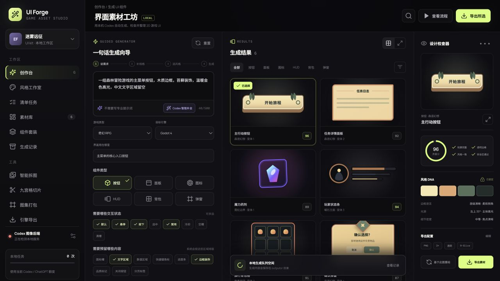
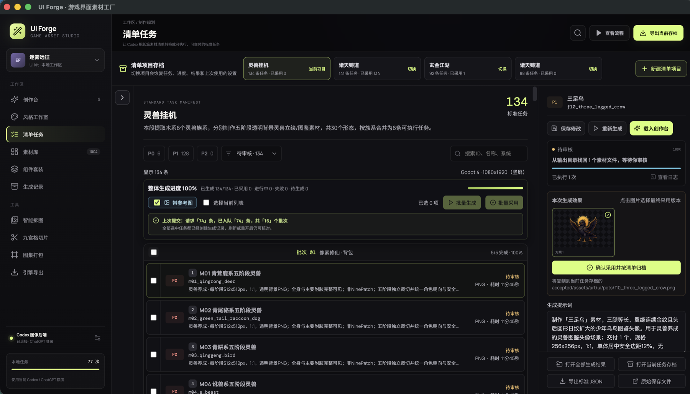
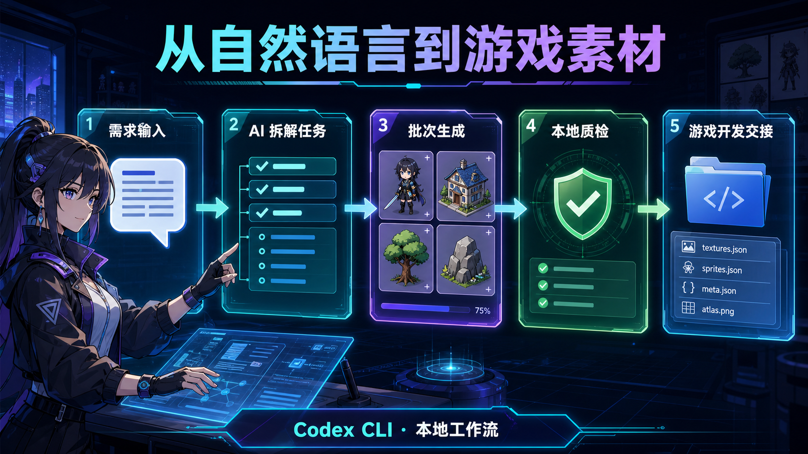
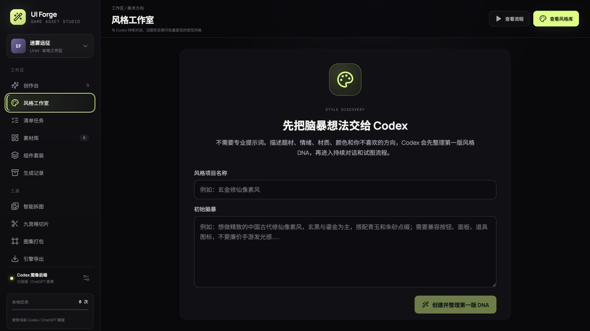
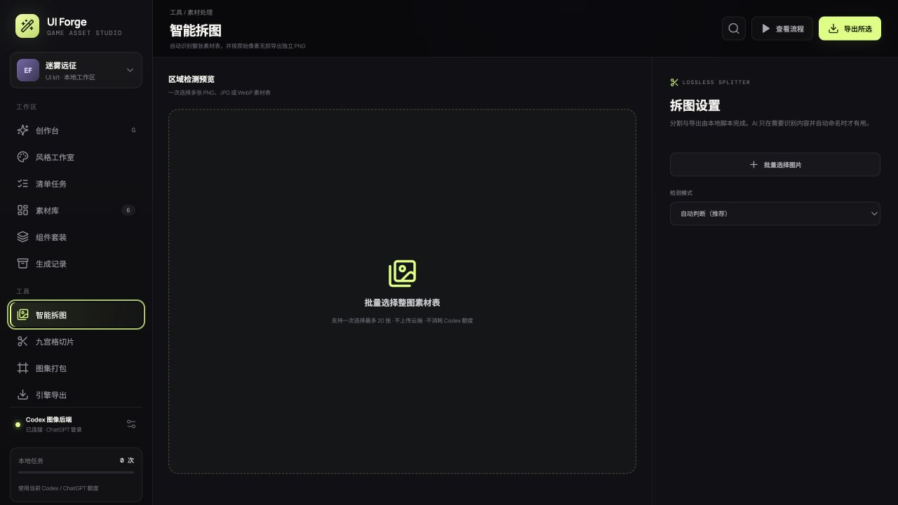
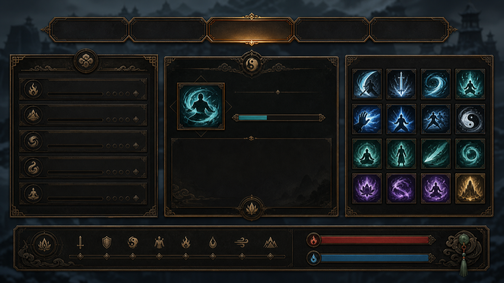
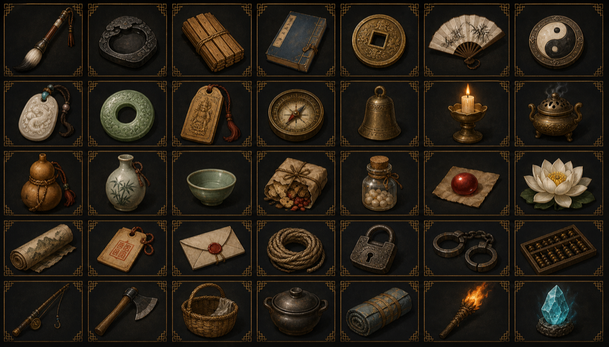
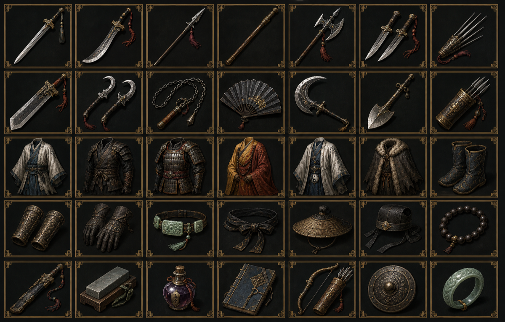
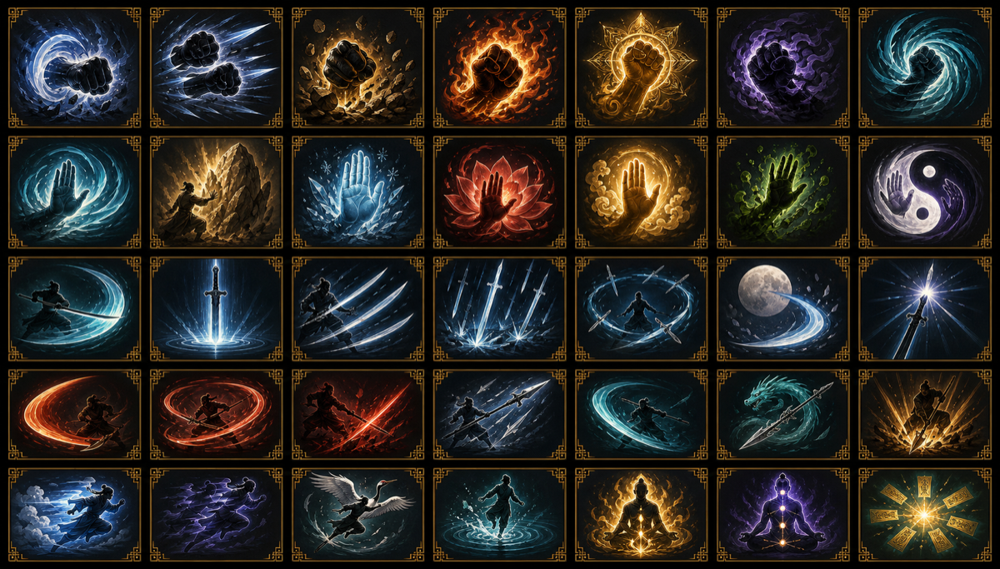

<p align="center">
  <a href="./README.md"><strong>English</strong></a> ·
  <a href="./README.zh-CN.md">简体中文</a>
</p>

<p align="center">
  
</p>

<h1 align="center">Codex Asset Forge</h1>

<p align="center">
  Turn natural-language game asset requirements into controllable image tasks,<br />
  generate them locally through Codex CLI, and hand the results back to your game project.
</p>

<p align="center">
  <em>Natural-language game development handoffs, AI-planned image tasks, and local Codex-powered asset production.</em>
</p>

<p align="center">
  
  
  
  
</p>

> The desktop app currently displays the name **UI Forge** so existing macOS workspaces remain compatible. The open-source project is called **Codex Asset Forge**.

## Why this project exists

Generating one image in a chat is easy. Producing a complete asset set for a real game is not. Someone still has to understand what the interface needs, turn a design document into dozens or hundreds of precise image jobs, define styles and dimensions, keep filenames stable, recover failed jobs, review every result, and tell the game-development AI where everything was saved.

Codex Asset Forge is not just another image-generation panel. It is a local handoff layer between the AI building your game and the AI generating its visual assets.

Give it natural language, a Markdown design document, or an asset manifest. It can:

- Reuse the login already stored by your local Codex CLI. With ChatGPT login, no separate OpenAI API key is required by default.
- Analyze prose, design documents, and semi-structured manifests to identify the images your game actually needs.
- Expand every requirement into a task with a stable ID, prompt, dimensions, quantity, filename, destination, and acceptance criteria.
- Run each task or small batch in an independent ephemeral Codex conversation so one huge context does not slow down the entire project.
- Keep tasks, images, logs, references, and handoff JSON inside your local workspace.
- Show progress, elapsed time, errors, review state, and the final accepted result for every asset.
- Export machine-readable paths, purposes, and specifications so another AI can continue building the Godot, Unity, or Web game without re-inspecting hundreds of images.

> [!IMPORTANT]
> This is not a “free” or “unlimited” image generator. Images generated through Codex still count against your Codex usage allowance and generally consume allowance faster than text-only work. The project removes separate API-key setup, a second API bill, and a large amount of manual orchestration—not the underlying generation cost. See OpenAI's [image generation guide](https://learn.chatgpt.com/docs/image-generation.md) and [authentication guide](https://learn.chatgpt.com/docs/auth.md).

## Natural-language handoff

You do not need to write 100 production prompts by hand. Start with the material your game project already has:

```text
The combat screen needs a five-element skill icon set. Each skill has normal,
cooldown, and disabled states. Use a polished Chinese cultivation pixel-art style.
Save the icons under assets/art/ui/skills/ and use stable English IDs because
the Godot scripts will load them from the manifest.
```

Codex Asset Forge turns that into independently executable tasks:

```text
assetId          fire_sword_art
deliverables     normal / cooldown / disabled (3 files)
size and format  128x128, transparent PNG
filename         fire_sword_art_<state>.png
destination      assets/art/ui/skills/
prompt           asset semantics + project style DNA + technical constraints
acceptance       distinct states, complete silhouette, clean transparent edges
```

After generation and review, the app exports a standard JSON manifest, semantic asset index, and local paths. The next development AI can understand what each file is, where it lives, which version was accepted, and how it should be used—without looking at every image again.

## Product tour

<p align="center">
  
</p>

<p align="center"><sub>Guided Creator — turn one natural-language request into a complete component, state, size, style-DNA, reference-image, and output specification.</sub></p>

<p align="center">
  
</p>

<p align="center"><sub>Live Manifest — manage large asset sets by project and batch, with per-item progress, elapsed time, review state, preview, and accepted output path.</sub></p>

<p align="center">
  
</p>

<p align="center"><sub>From natural-language requirements to AI planning, batch generation, local review, and game-development handoff.</sub></p>

<table>
  <tr>
    <td width="50%"></td>
    <td width="50%"></td>
  </tr>
  <tr>
    <td align="center"><sub>Style Studio — refine reusable style DNA through conversation</sub></td>
    <td align="center"><sub>Smart Split — detect irregular asset sheets and export lossless crops</sub></td>
  </tr>
</table>

> Product screenshots show the creator, a real manifest workflow, and local generation results. They do not contain personal credentials or local absolute paths.

## Generated asset showcase

The examples below use one shared “Xuanjin” style DNA across UI boards, inventory items, weapons, and martial-arts skills.

<table>
  <tr>
    <td width="50%"></td>
    <td width="50%"></td>
  </tr>
  <tr>
    <td align="center"><sub>UI style board</sub></td>
    <td align="center"><sub>Inventory and cultivation items</sub></td>
  </tr>
  <tr>
    <td></td>
    <td></td>
  </tr>
  <tr>
    <td align="center"><sub>Weapons and equipment</sub></td>
    <td align="center"><sub>Martial-arts skills</sub></td>
  </tr>
</table>

## Built-in and custom styles

<p align="center">
  
</p>

The project includes 12 ready-to-use game UI styles. Style Studio also lets you develop custom style DNA through conversation, written direction, and one or two reference images. Reference images are optional per batch and supplement rather than overwrite the written style requirements.

## Core capabilities

| Module | What it does |
| --- | --- |
| Guided Creator | Compiles a natural-language request into a full generation specification with components, states, dimensions, transparency, style, and references |
| Style Studio | Refines style DNA through Codex conversation, generates validation samples, and saves the final description with one or two reference images |
| AI Manifest Analysis | Reads MD, TXT, JSON, and prose design documents; identifies required images and fills missing production specifications |
| Manifest Tasks | Creates stable IDs, filenames, sizes, destinations, detailed prompts, states, and acceptance rules |
| Batch Production | Runs 1, 4, 5, or 6 similar assets in one Codex conversation while preserving per-item progress, timing, results, and retries |
| Review and Accept | Opens full-size results, supports multi-deliverable tasks and bulk acceptance, and writes metadata other AIs can read directly |
| Smart Split | Detects irregular sheets or uses arbitrary grid settings to crop source pixels losslessly and export PNGs, `assets.json`, and an index |
| Resource Center | Manages Kenney, Game-icons, model folders, and an optional ComfyUI backend |
| Development Handoff | Exports local paths, standard JSON, and a semantic asset index for Godot, Unity, Web, and downstream development agents |

## Workflow

```mermaid
flowchart LR
    A["Game prototype / development AI / design docs"] --> B["Natural-language asset requirements"]
    B --> C["Codex analyzes and creates standard image tasks"]
    C --> D["Visual task queue and style DNA"]
    D --> E["Independent codex exec batches"]
    E --> F["$imagegen generation and local processing"]
    F --> G["Per-item review and acceptance"]
    G --> H["Images + paths + semantic metadata"]
    H --> I["Godot / Unity / Web / downstream AI"]
```



A typical manifest workflow:

1. Import the asset manifest produced during game prototyping.
2. Let Codex extract tasks in bounded sections and fill in style, dimensions, filenames, destinations, and acceptance criteria.
3. Choose batch size and concurrency, then run exactly the batches or items you want.
4. The first valid result is selected by default; change it only when another deliverable is better.
5. Export standard JSON or the semantic asset index so the next AI can continue development without re-analyzing every image.

## Requirements

- Node.js 20 or later
- npm
- A working Codex CLI
- A signed-in ChatGPT/Codex account, or API-key authentication if you prefer it
- macOS on Apple Silicon to build the current desktop app

Check your Codex installation and authentication:

```bash
codex --version
codex login status
```

If you are not signed in:

```bash
codex login
```

Codex CLI supports both ChatGPT login and API-key authentication. This project reuses the CLI's saved login by default. See [Codex authentication](https://learn.chatgpt.com/docs/auth.md).

## Quick start

```bash
git clone https://github.com/Brycetlm/codex-asset-forge.git
cd codex-asset-forge
npm ci
npm run dev
```

Open [http://127.0.0.1:1420](http://127.0.0.1:1420). Development mode starts:

- Vite UI at `127.0.0.1:1420`
- Local task service at `127.0.0.1:4319`

The service listens only on localhost and does not expose an arbitrary command-execution API.

## Build the macOS app

```bash
npm run app:build
```

The Apple Silicon build is written to:

```text
release/mac-arm64/UI Forge.app
```

The app selects an available port, starts the local service, and connects to Codex CLI automatically. Closing the app also stops its local service. The packaged app stores its workspace at:

```text
~/Library/Application Support/UI Forge/workspace
```

## How Codex is invoked

Generation tasks use Codex CLI in non-interactive mode:

```text
codex exec --ephemeral --json --sandbox workspace-write
```

- `--ephemeral` gives each task or small batch an independent temporary conversation.
- `--json` emits structured events for progress, stages, tool calls, and errors.
- `--sandbox workspace-write` limits writes to the task workspace.
- `$imagegen` explicitly asks Codex to use its built-in image-generation capability.

See Codex's [non-interactive mode documentation](https://learn.chatgpt.com/docs/non-interactive-mode.md) for the underlying CLI behavior.

## Local data layout

Development mode uses the repository by default; the packaged app uses a separate user workspace.

```text
data/                         local task state, style projects, and run logs
outputs/                      generated results
outputs/task-manifests/       archived manifests, standard JSON, accepted outputs
outputs/splits/               smart-split results and logs
references/                   uploaded reference images
library/imports/              downloaded open-source asset packs
```

These runtime directories are excluded by `.gitignore`. The repository never reads or commits `~/.codex/auth.json`. That file contains Codex credentials and must never be uploaded, copied into an issue, or shared.

## Optional Python environment for Smart Split

Automatic detection and lossless cropping require Pillow, NumPy, and SciPy. A dedicated virtual environment is recommended:

```bash
python3 -m venv .venv
source .venv/bin/activate
python -m pip install Pillow numpy scipy
UI_FORGE_PYTHON_BIN="$PWD/.venv/bin/python" npm run dev
```

Rule-based grid splitting does not require AI. Additional visual processing is needed only when you ask Codex to understand, name, or classify the cropped assets.

## Configuration

| Environment variable | Purpose | Default |
| --- | --- | --- |
| `CODEX_BIN` | Path to the Codex CLI executable | Codex bundled with the ChatGPT app |
| `UI_FORGE_API_PORT` | Local task-service port | `4319` |
| `UI_FORGE_WORKSPACE_DIR` | Data and output workspace | Current directory |
| `UI_FORGE_STATIC_DIR` | Static frontend directory | Served by Vite in development |
| `UI_FORGE_PYTHON_BIN` | Python executable used by Smart Split | Auto-detected |
| `UI_FORGE_MANIFEST_CHUNK_TIMEOUT_MS` | Timeout for one manifest-analysis section | `300000` |
| `UI_FORGE_GENERATION_CONCURRENCY` | Simultaneous generation batches | `1`, configurable up to `3` in the UI |

## Visible capacity and behavior limits

- One manifest project allows 200 tasks by default, configurable from 20 to 500.
- One Codex batch may contain 1, 4, 5, or 6 assets of a similar style and type.
- Up to 3 Codex batches can run simultaneously.
- Unexplained generation failures retry automatically up to 3 times before requiring user action.
- Smart Split accepts up to 20 source images at once and previews up to 250 rule-grid regions.
- After a restart, the app restores queued and running batches while preserving valid files already written to disk.

These boundaries are visible in the interface. Submission results report the requested count, queued count, batch count, and every skipped item with its reason.

## Open-source assets and licenses

The project can download or register third-party packs, but those files are not committed to this repository:

- [Kenney UI Pack](https://kenney.nl/assets/ui-pack): CC0
- [Game-icons.net](https://game-icons.net/): CC BY 3.0; attribution is required when applicable

Each imported folder stores a `source.json` file with the source, license, import time, and required attribution. You remain responsible for confirming that models, LoRAs, references, and generated content are suitable for your intended release.

## Public-repository safety check

Run this before publishing changes:

```bash
npm run audit:public
```

The audit blocks common API keys, tokens, private keys, local user paths, runtime logs, personal reference images, and generated outputs from entering Git. It reports filenames and matched rules without printing suspected secrets to the terminal.

GitHub Secret scanning and Push protection are also recommended for the public repository.

## Development commands

```bash
npm run dev           # frontend and local task service
npm run build         # TypeScript checks and production build
npm run app:dev       # build and launch the Electron app
npm run app:build     # build the Apple Silicon macOS app
npm run audit:public  # public-release privacy and secret audit
```

## Current limitations

- Image generation is stochastic. Style DNA and reference images improve consistency but cannot guarantee pixel-level reproduction.
- Text, typography, complex SVG, NinePatch, and multi-state deliverables still require human review.
- Only Apple Silicon macOS desktop build scripts are included today. Other platforms can use Web development mode.
- Large batches can consume Codex allowance quickly. Use the Image API or a local ComfyUI backend when you need independent billing, deployment, or much higher throughput.

## Contributing

Issues, sample manifests, style templates, splitter improvements, and game-engine export adapters are welcome.

Before opening a pull request, run at least:

```bash
npm ci
npm run audit:public
npm run build
```

Do not commit generated outputs, personal reference images, task logs, Codex authentication files, or documents containing local absolute paths.

## License

[MIT](./LICENSE)

Codex, ChatGPT, and OpenAI are trademarks of their respective owners. This is an independent open-source project and is not an official OpenAI product or endorsement.
